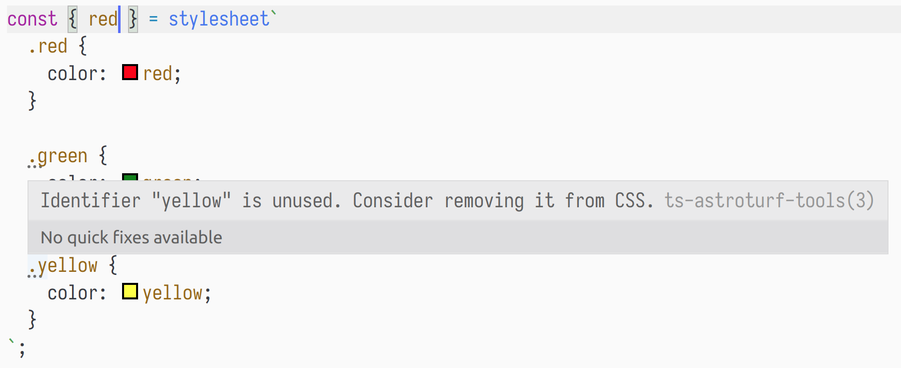
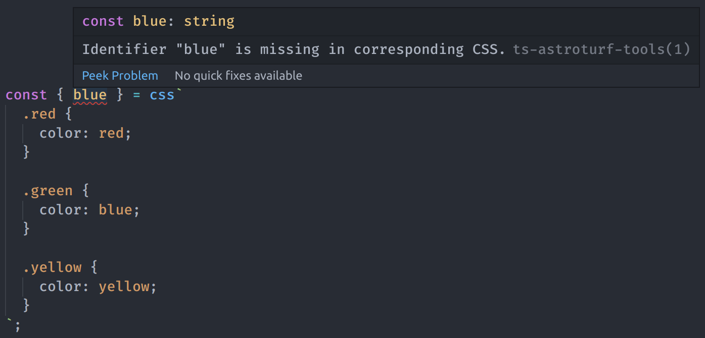
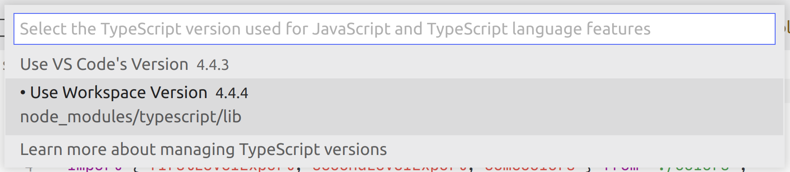

# ts-astroturf-tools [beta! 🚧]

[](https://www.npmjs.com/package/ts-astroturf-tools) [](https://www.npmjs.com/package/ts-astroturf-tools) [](https://travis-ci.org/dkamyshov/ts-astroturf-tools) [](https://coveralls.io/github/dkamyshov/ts-astroturf-tools?branch=master)

This package improves DX for [astroturf](https://github.com/4Catalyzer/astroturf) users.

## Installation

```
yarn add -D ts-astroturf-tools
```

```
npm i --save-dev ts-astroturf-tools
```

## Overview

Features are divided in three major categories:

- [linaria](https://github.com/callstack/linaria)-like functionality (formerly known as "direct mode")
- diagnostic messages
- autocomplete for identifiers

## `linaria`-like functionality

- Declare class names as separate variables:

  Improves type-safety!

  ```js
  // * before
  import { css } from 'astroturf';

  const { btn, active } = css`
    .btn {
      color: red;
    }

    .active {
      color: black;
    }
  `;

  // * after
  import { xcss } from 'ts-astroturf-tools/xcss';

  const btn = xcss`
    color: red;
  `;

  const active = xcss`
    color: black;
  `;
  ```

- Use variables declared in other modules inside your CSS:

  ```js
  // * before
  // impossible :(

  // * after
  // colors.tsx
  export const RED = 'red';

  // index.tsx
  import { xcss } from 'ts-astroturf-tools/xcss';
  import { RED } from './colors';

  const btn = xcss`
    color: ${RED};
  `;

  // works for styled components too!
  import styled from 'astroturf';

  const Button = styled.button`
    color: ${RED};
  `;
  ```

## Diagnostic messages

These messages are available if you use plain `css` tag from `astroturf`.

There are two types of diagnostic messages:

- warnings in case there is unused CSS

  Available via:

  - webpack loader
  - babel plugin
  - TS Language Service Plugin (VS Code)

  ```js
  import { css } from 'astroturf';

  const { btn } = css`
    .btn {
      color: red;
    }

    .active {
      color: green;
    }
  `;
  ```

  The warning will look like this:

  <pre style="color: orange;">
  /path/to/file.js:8:3:
    Identifier "active" is unused. Consider removing it from CSS.
  </pre>

  In VS Code the warning will become a suggestion:

  

- errors in case there is missing CSS

  Available via:

  - webpack loader
  - babel plugin
  - TS Language Service Plugin (VS Code)

  ```js
  import { css } from 'astroturf';

  const { btn, active } = css`
    .btn {
      color: red;
    }
  `;
  ```

  The error will look like this:

  <pre style="color: red;">
  /path/to/file.js:3:14:
    Identifier "active" is missing in corresponding CSS.
  </pre>

  In VS Code:

  

## Autocomplete for identifiers

Available via:

- TS Language Service Plugin (VS Code)


## Quick summary of tools and their respective features

| Tool                       | Diagnostic messages | Autocomplete for identifiers | `linaria`-like functionality |
| -------------------------- | ------------------- | ---------------------------- | ---------------------------- |
| TS Language Service Plugin | ✅                  | ✅                           | `N/A`                        |
| webpack loader             | ✅                  | `N/A`                        | ✅ _optional_                |
| babel plugin               | ✅                  | `N/A`                        | ❌                           |
| TS transformer             | ❌                  | `N/A`                        | ✅                           |

- `N/A` - not applicable

## Configuration

- TS Language Service Plugin

  Add `ts-astroturf-tools` as a plugin to your `tsconfig.json`:

  ```json
  {
    "compilerOptions": {
      "plugins": [
        {
          "name": "ts-astroturf-tools"
        }
      ]
    },
    "files": ["src/index.tsx"],
    "exclude": ["node_modules"]
  }
  ```

  Don't forget to switch to workspace typescript instance:

  

- TS transformer:

  - raw TypeScript

    You should use [ttypescript](https://www.npmjs.com/package/ttypescript) as a compiler.

    Add `ts-astroturf-tools/transformer` as a transformer to your `tsconfig.json`:

    ```json
    {
      "compilerOptions": {
        "plugins": [
          {
            "transform": "ts-astroturf-tools/transformer"
          }
        ]
      },
      "files": ["src/index.tsx"],
      "exclude": ["node_modules"]
    }
    ```

  - webpack / awesome-typescript-loader

    ```js
    const transformer = require('ts-astroturf-tools/transformer');

    module.exports = {
      // ...
      module: {
        // ...
        rules: [
          {
            test: /\.tsx$/,
            use: {
              loader: 'awesome-typescript-loader',
              options: {
                // ...
                getCustomTransformers: () => ({
                  before: [transformer()],
                }),
              },
            },
          },
        ],
      },
    };
    ```

- webpack loader

  Add `ts-astroturf-tools/loader` as a first loader for ts-files:

  ```javascript
  module.exports = {
    // ...
    module: {
      rules: [
        // ...
        {
          test: /\.tsx?$/,
          use: [
            // works with any typescript loader
            'awesome-typescript-loader',
            'astroturf/loader',
            'ts-astroturf-tools/loader',
          ],
        },
      ],
    },
  };
  ```

  Available options:

  | Option name | Type      | Description                           |
  | ----------- | --------- | ------------------------------------- |
  | `linaria`   | `boolean` | Enables `linaria`-like functionality. |

  Defaults:

  ```javascript
  module.exports = {
    // ...
    module: {
      rules: [
        // ...
        {
          test: /\.tsx?$/,
          use: [
            // works with any typescript loader
            'awesome-typescript-loader',
            'astroturf/loader',
            {
              loader: 'ts-astroturf-tools/loader',
              options: {
                linaria: false,
              },
            },
          ],
        },
      ],
    },
  };
  ```

- Babel plugin

  Add `ts-stroturf-tools/babel-plugin` to your babel plugins:

  ```js
  module.exports = {
    presets: ['@babel/env', '@babel/preset-react'],
    plugins: ['ts-astroturf-tools/babel-plugin'],
  };
  ```

## Known limitations

- Regex-based parser is used to extract CSS class names.

  TypeScript compiler API is synchronous, while `css-modules-loader-core` API is asynchronous (Promise-based), which means that it is impossible to reuse the latter for the purpose of parsing CSS in Language Service plugin.

- Limited support for imports

  Supported extensions: `.tsx`, `.ts`, `.js`.

  Files must not contain side-effects, import other heavy modules and / or libraries and code that must be transpiled.

  This is ok:

  ```js
  // a.js
  export const redColor = 'red';

  // b.js
  export const greenColor = 'green';
  export { redColor } from './a.js';

  // index.js
  import { greenColor, redColor } from './a.js';
  import styled from 'astroturf';

  const Button = styled.button`
    color: ${redColor};
    background: ${greenColor};
  `;
  ```

  This is **not ok** and will most likely result in an error:

  ```js
  // a.js
  import * as React from 'react';
  import image from './someImage.png';
  export const redColor = 'red';

  export const Something = () => <div style={{ background: `url(${image});` }}>Hello!</div>;

  // b.js
  export const greenColor = 'green';
  export { redColor } from './a.js';

  // index.js
  import { greenColor, redColor } from './a.js';
  import styled from 'astroturf';

  const Button = styled.button`
    color: ${redColor};
    background: ${greenColor};
  `;
  ```

- Performance issues with imports **(this issue is in progress of being fixed)**

  As of now, files are parsed and executed for each encountered import.

  For example:

  ```js
  // a.js
  export const RED = 'red';

  // b.js
  export { RED } from './a';
  export const GREEN = 'green';

  // ComponentA.js
  import styled from 'astroturf';
  import { GREEN } from './b';

  export const ComponentA = styled.div`
    color: ${GREEN};
  `;

  // ComponentB.js
  import styled from 'astroturf';
  import { RED } from './b';

  export const ComponentB = styled.div`
    color: ${RED};
  `;
  ```

  In this case both `a.js` and `b.js` will be parsed and executed twice (first for `ComponentA.js` and then for `ComponentB.js`). Keep this in mind and try to avoid creating large dependency trees.

- Limited support for interpolations

  ```javascript
  const WIDTH = '500px';

  // ok
  const { a } = css`
    .a {
      width: ${WIDTH};
    }
  `;
  ```

  ```javascript
  const NAME = 'someClass';

  //        error
  //      vvvvvvvvv
  const { someClass } = css`
    .${NAME} {
      color: red;
    }
  `;
  ```

- Only plain CSS is supported.

  Basic features of SASS/LESS/etc. may work:

  ```javascript
  // simple nesting is ok
  const { someClass, anotherClass } = css`
    .someClass {
      color: red;

      &.anotherClass {
        border: 1px solid black;
      }
    }
  `;
  ```

  Advanced features will most probably not work:

  ```javascript
  //                    error!
  //                 vvvvvvvvvvvv
  const { someClass, anotherClass } = css`
    @name: anotherClass;

    .someClass {
      color: red;

      &.@{name} {
        color: black;
      }
    }
  `;
  ```

- It is not possible to show errors in case destructuring is not used:

  ```typescript
  const classes = css`
    .a {
      color: red;
    }
  `;

  console.log(a.b); // <- no error
  ```

  The simplest solution would be to wrap the declaration in the following way:

  ```typescript
  const classes = css`
    .a {
      color: red;
    }
  ` as {
    a: string;
  };

  console.log(a.b); // <- error!
  ```

  This is not an option because of the following:

  1. It is impossible to alter AST before type-checker pass both in Language Service plugin and in typescript transformers.

     _It is still possible to invoke type-checker manually, but it will result in substantial increase in build time._

     _It is also possible to track the usage of a variable in the file._

  2. These modifications must affect the whole project so even if this identifier is exported in some other module the type-checker could do its job.

     _Possible solution: add intermediate build step, in which TS code is transpiled to TS code with necessary modifications._
