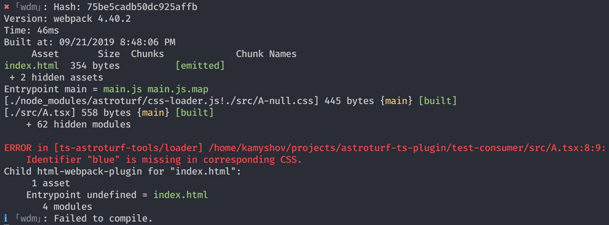

# ts-astroturf-tools [early alpha 🚧]

This package is for developers who use both [astroturf](https://github.com/4Catalyzer/astroturf) and [TypeScript](https://www.typescriptlang.org/) and want to maximize type-safety of their code.

## Installation [not yet available]

```
$ npm i --save-dev ts-astroturf-tools
```

## Features

- 📝 Get an error message in case class names in template string literal do not match the specified identifiers:

  

- 🧰 Get the same message during build:

  

- 📝 Autocomplete for identifiers:

  

## Tools

This package consists of two tools:

- TypeScript Language Service Plugin (in-editor error messages, autocomplete)
- webpack loader (build-time error messages)

## Configuration

- TypeScript Language Service Plugin for astroturf

  Add `ts-astroturf-tools` as a plugin to your `tsconfig.json`:

  ```json
  {
    "compilerOptions": {
      "plugins": [
        {
          "name": "ts-astroturf-tools"
        }
      ]
    },
    "files": ["src/index.tsx"],
    "exclude": ["node_modules"]
  }
  ```

  Don't forget to switch to workspace typescript instance:

  

- webpack loader

  Add `ts-astroturf-tools/loader` as a first loader for ts-files:

  ```javascript
  module.exports = {
    // ...
    module: {
      rules: [
        // ...
        {
          test: /\.tsx?$/,
          use: [
            // works with any typescript loader
            'awesome-typescript-loader',
            'astroturf/loader',
            'ts-astroturf-tools/loader',
          ],
        },
      ],
    },
  };
  ```

## Known limitations

- Regex-based parser is used to extract CSS class names.

  TypeScript compiler API is synchronous, while `css-modules-loader-core` API is asynchronous (Promise-based), which means that it is impossible to reuse the latter for the purpose of parsing CSS in Language Service plugin.

- Only plain CSS is supported.

  LESS, SASS, etc. may work, but without any guarantees of stability.

- It is not possible to show errors in case destructuring is not used:

  ```typescript
  const classes = css`
    .a {
      color: red;
    }
  `;

  console.log(a.b); // <- no error
  ```

  The simplest solution would be to wrap the declaration in the following way:

  ```typescript
  const classes = css`
    .a {
      color: red;
    }
  ` as {
    a: string;
  };

  console.log(a.b); // <- error!
  ```

  This is not an option because of the following:

  1. It is impossible to alter AST before type-checker pass both in Language Service plugin and in typescript transformers.

     _It is still possible to invoke type-checker manually, but it will result in substantial increase in build time._

     _It is also possible to track the usage of a variable in the file._

  2. These modifications must affect the whole project so even if this identifier is exported in some other module the type-checker could do its job.

     _Possible solution: add intermediate build step, in which TS code is transpiled to TS code with necessary modifications._

- In webpack's watch mode errors are reported only for modified files.

  Suppose you have files `A.tsx` and `B.tsx` and you use `webpack-dev-server`. During the first run errors from both files will be reported. If you fix the error in `A.tsx` and save it, webpack will not report errors in `B.tsx` anymore.

  This is acceptable for CI (because any run in CI is "the first run"), but it is quite annoying during development.

  **This issue is in process of being fixed.**
