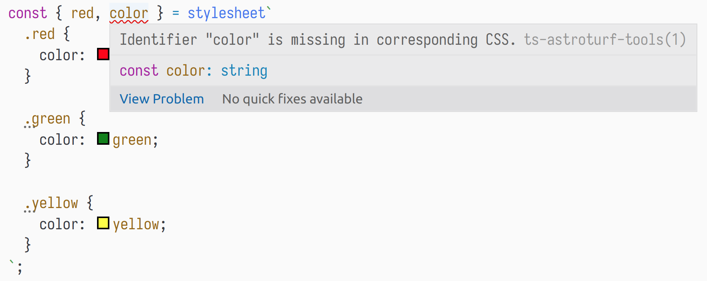

# ts-astroturf-tools [early alpha 🚧]

[](https://www.npmjs.com/package/ts-astroturf-tools) [](https://www.npmjs.com/package/ts-astroturf-tools) [](https://travis-ci.org/dkamyshov/ts-astroturf-tools) [](https://coveralls.io/github/dkamyshov/ts-astroturf-tools?branch=master)

This package is for developers who use both [astroturf](https://github.com/4Catalyzer/astroturf) and [TypeScript](https://www.typescriptlang.org/) and want to maximize type-safety of their code.

## Installation

```
$ npm i --save-dev ts-astroturf-tools
```

## Features

- 📝 Get an error message in case class names in template string literal do not match the specified identifiers:

  

- 🧰 Get the same message during webpack build:

  

- 📝 Get suggestion message in case CSS class name is unused:

  

- 🧰 Get the same message as a warning during webpack build:

  

- 📝 Autocomplete for identifiers:

  

- 🧰 Same errors and warnings during babel-only build:

  

  

- "Direct mode" for `css` **(right now it only works if you use webpack loader)**

  This is possible in direct mode:

  ```typescript
  import { xcss } from 'ts-astroturf-tools';

  const redClassName = xcss`
    color: red;
  `;

  const greenClassName = xcss`
    color: green;
  `;

  const obj = {
    red: xcss`
      color: red;
    `,

    green: xcss`
      color: green;
    `,
  };
  ```

  Enable direct mode by passing `direct: true` to the loader:

  ```json
  {
    "loader": "ts-astroturf-tools/loader",
    "options": {
      "direct": true
    }
  }
  ```

## Tools

This package consists of three tools:

- TypeScript Language Service Plugin (in-editor error messages, autocomplete)
- webpack loader (build-time error messages for webpack)
- babel plugin (build-time error messages for babel)

## Configuration

- TypeScript Language Service Plugin for astroturf

  Add `ts-astroturf-tools` as a plugin to your `tsconfig.json`:

  ```json
  {
    "compilerOptions": {
      "plugins": [
        {
          "name": "ts-astroturf-tools"
        }
      ]
    },
    "files": ["src/index.tsx"],
    "exclude": ["node_modules"]
  }
  ```

  Don't forget to switch to workspace typescript instance:

  

- webpack loader

  Add `ts-astroturf-tools/loader` as a first loader for ts-files:

  ```javascript
  module.exports = {
    // ...
    module: {
      rules: [
        // ...
        {
          test: /\.tsx?$/,
          use: [
            // works with any typescript loader
            'awesome-typescript-loader',
            'astroturf/loader',
            'ts-astroturf-tools/loader',
          ],
        },
      ],
    },
  };
  ```

  Available options:

  | Option name | Type      | Description                            |
  | ----------- | --------- | -------------------------------------- |
  | `direct`    | `boolean` | Enables direct mode (calls to `xcss`). |

  Defaults:

  ```javascript
  module.exports = {
    // ...
    module: {
      rules: [
        // ...
        {
          test: /\.tsx?$/,
          use: [
            // works with any typescript loader
            'awesome-typescript-loader',
            'astroturf/loader',
            {
              loader: 'ts-astroturf-tools/loader',
              options: {
                direct: false,
              },
            },
          ],
        },
      ],
    },
  };
  ```

- Babel plugin

  Add `ts-stroturf-tools/babel-plugin` to your babel plugins:

  ```js
  module.exports = {
    presets: ['@babel/env', '@babel/preset-react'],
    plugins: ['ts-astroturf-tools/babel-plugin'],
  };
  ```

## Known limitations

- Regex-based parser is used to extract CSS class names.

  TypeScript compiler API is synchronous, while `css-modules-loader-core` API is asynchronous (Promise-based), which means that it is impossible to reuse the latter for the purpose of parsing CSS in Language Service plugin.

- Limited support for interpolations

  ```javascript
  const WIDTH = '500px';

  // ok
  const { a } = css`
    .a {
      width: ${WIDTH};
    }
  `;
  ```

  ```javascript
  const NAME = 'someClass';

  //        error
  //      vvvvvvvvv
  const { someClass } = css`
    .${NAME} {
      color: red;
    }
  `;
  ```

  Beware of nested multi-line interpolations! **[this particular issue is in progress of being fixed]**

  In this example `className`, `map`, `toLowerCase`, `toUpperCase` will be treated as available class names:

  ```javascript
  // sadly, this is ok :(
  const { className, map, toLowerCase, toUpperCase } = css`
    .className {
      color: ${NAME.map(
        x =>
          `${x
            .toLowerCase()
            .toUpperCase()
            .toLowerCase()
            .toUpperCase()}`
      )[0]};
    }
  `;
  ```

- Only plain CSS is supported.

  Basic features of SASS/LESS/etc. may work:

  ```javascript
  // simple nesting is ok
  const { someClass, anotherClass } = css`
    .someClass {
      color: red;

      &.anotherClass {
        border: 1px solid black;
      }
    }
  `;
  ```

  Advanced features will most probably not work:

  ```javascript
  //                    error!
  //                 vvvvvvvvvvvv
  const { someClass, anotherClass } = css`
    @name: anotherClass;

    .someClass {
      color: red;

      &.@{name} {
        color: black;
      }
    }
  `;
  ```

- It is not possible to show errors in case destructuring is not used:

  ```typescript
  const classes = css`
    .a {
      color: red;
    }
  `;

  console.log(a.b); // <- no error
  ```

  The simplest solution would be to wrap the declaration in the following way:

  ```typescript
  const classes = css`
    .a {
      color: red;
    }
  ` as {
    a: string;
  };

  console.log(a.b); // <- error!
  ```

  This is not an option because of the following:

  1. It is impossible to alter AST before type-checker pass both in Language Service plugin and in typescript transformers.

     _It is still possible to invoke type-checker manually, but it will result in substantial increase in build time._

     _It is also possible to track the usage of a variable in the file._

  2. These modifications must affect the whole project so even if this identifier is exported in some other module the type-checker could do its job.

     _Possible solution: add intermediate build step, in which TS code is transpiled to TS code with necessary modifications._
